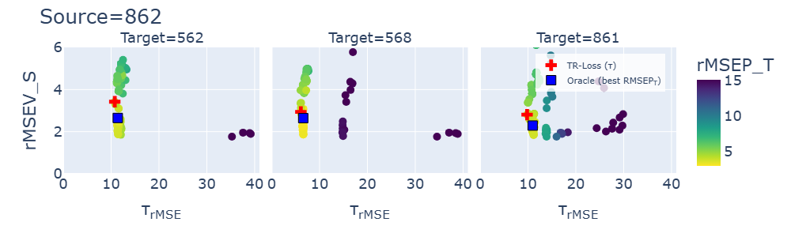

# Transferability Loss for Safe Model Selection under Domain Shift

Official code for the ICLR 2026 paper:

> Nikzad-Langerodi, R., & Fonseca Diaz, V. *Transferability Loss for Safe Model Selection under Domain Shift.* In Catch, Adapt, and Operate: Monitoring ML Models Under Drift Workshop (ICLR2026).


<p align="center">
	
</p>

---

## Overview

Model selection in unsupervised domain adaptation (UDA) is notoriously difficult and existing approaches based on distribution alignment (e.g., MMD) can lead to **negative transfer** and **catastrophic failure** when domain shifts are unfavorable.

**TR-LOSS** is a model-agnostic criterion for **safe** model selection in UDA. It measures representational consistency between a source anchor and its adapted counterpart, establishing an operational safety bound: the target risk of any adapted hypothesis lies within a computable interval centered on the (known) source risk. Minimizing TR-LOSS yields a **minimax robustness** strategy that avoids the worst-case degradation relative to the trusted source model.

### Key Properties

- **Model-agnostic:** Works with any adaptation method that produces paired source and target hypotheses.
- **Safety guarantee:** Provides a bound on worst-case target performance relative to the source anchor.
- **No target labels required:** Selection is fully unsupervised on the target side.
- **Robustness over optimism:** Prioritizes avoiding catastrophic failure over chasing average-case improvement.

---

## Quick Start  Use TR-LOSS with Your Own Model

TR-LOSS is completely **model-agnostic**. If your UDA method produces paired predictions on target data from a source hypothesis and an adapted hypothesis, you can use TR-LOSS for model selection in a few lines:

```python
import sys
sys.path.append("path/to/methods/")
from trloss import transferability_loss, selection_criterion

# After fitting your UDA model, get predictions on target data from both hypotheses:
# y_source_pred = source_model.predict(X_target)
# y_adapted_pred = adapted_model.predict(X_target)

# Regression: tau_MSE (lower = better agreement)
tau = transferability_loss(y_source_pred, y_adapted_pred, task="regression")

# Classification: tau_ACC (higher = better agreement)
tau = transferability_loss(y_source_pred, y_adapted_pred, task="classification")

# Composite model-selection criterion
# Regression (Eq. 10):  J = MSE_S + tau_MSE  -> minimize
J = selection_criterion(mse_source_val, tau, task="regression")

# Classification (Eq. 11):  J = ACC_S + tau_ACC  -> maximize
J = selection_criterion(acc_source_val, tau, task="classification")
```

---

## Repository Structure

```
.
├── env.yml                          # Conda environment specification
├── README.md
│
├── data/
│   ├── melamine/
│   │   ├── Melamine_Dataset.mat     # NIR spectra for 4 recipes
│   │   └── readme.txt
│   └── hypercamera/
│       ├── spectrometer.csv         # Source domain (spectrometer)
│       ├── hypercamera.csv          # Target domain (hyperspectral camera)
│       └── README.md
│
├── methods/
│   ├── __init__.py
│   ├── trloss.py                    # TR-LOSS criterion (main contribution)
│   ├── kdaPLS/
│   │   ├── __init__.py
│   │   ├── kdapls.py                # KUDA / Kernel DA-PLS adaptation model
│   │   └── metrics.py               # Backward-compatibility shim
│   └── metrics/
│       ├── __init__.py
│       └── mmd.py                   # MMD baselines (linear, RBF)
│
└── experiments/
    └── 2026-03-15/
        └── scripts/
            ├── 01_melamine_dapls_allpairs_g2.ipynb   # Melamine NIR (12 pairs)
            ├── 02_mnist_simulation.ipynb              # MNIST (clean → noisy)
            └── 03_hypercamera.ipynb                   # Wheat flour (instrument transfer)
```

---

## Getting Started

### 1. Create the Conda environment

```bash
conda env create -f env.yml
conda activate trloss2026
```

### 2. Run experiments

Open the notebooks in VS Code (select the **trloss2026** kernel) or launch JupyterLab:

```bash
jupyter lab experiments/2026-03-15/scripts/
```

---

## Experiments

| # | Dataset | Task | Source -> Target | Notebook |
|---|---|---|---|---|
| 1 | Melamine NIR | Regression | 12 pairwise recipe transfers | ``01_melamine.ipynb`` |
| 2 | MNIST | Classification | Original -> Noisy | ``02_mnist.ipynb`` |
| 3 | Wheat Flour | Regression | Spectrometer -> Camera | ``03_hypercamera.ipynb`` |

### Model Selection Criteria Compared

| Criterion | Notation | Description |
|---|---|---|
| Source Validation | PERFV_S | Minimizes source validation error (naive baseline) |
| Source + MMD | PERFV_S + MMD | Source error + Maximum Mean Discrepancy |
| **Source + TR-LOSS** | **PERFV_S + tau** | **Source error + transferability loss (proposed)** |
| Oracle | PERFV_T | Supervised target validation (upper bound) |

---

## Core API

### ``trloss.transferability_loss``

```python
from trloss import transferability_loss

# Regression: returns tau_MSE (MSE between paired predictions)
tau = transferability_loss(y_source_pred, y_adapted_pred, task="regression")

# Classification: returns tau_ACC (accuracy/agreement between paired predictions)
tau = transferability_loss(y_source_pred, y_adapted_pred, task="classification")
```

### ``trloss.selection_criterion``

```python
from trloss import selection_criterion

# Regression (Eq. 10): J = MSE_S + tau_MSE -> minimize over hyperparameter grid
J = selection_criterion(mse_source_val, tau, task="regression")

# Classification (Eq. 11): J = ACC_S + tau_ACC -> maximize over hyperparameter grid
J = selection_criterion(acc_source_val, tau, task="classification")
```

### ``KDAPLSRegression`` (adaptation backbone used in experiments)

```python
from kdaPLS.kdapls import KDAPLSRegression

model = KDAPLSRegression(
    xs=X_source, xt=X_target,
    n_components=10,
    kdict={"type": "rbf", "gamma": 1.0},
    l=[0.01],
    target_domain=0
)
model.fit(X_source, y_source)

# Get predictions from BOTH hypotheses (for computing tau)
y_pred_all = model.predict_all(X_target_val)
# y_pred_all[0] -> source hypothesis predictions
# y_pred_all[1] -> adapted hypothesis predictions
```

### MMD Baselines

```python
from metrics.mmd import mmd_linear, mmd_rbf

mmd_val = mmd_rbf(latent_source, latent_target, gamma=1.0)
```

---

## Method Details

### Transferability Loss

Given paired source and target predictions on the target domain:

$$\tau_{\text{MSE}} = \frac{1}{n_t} \sum_{i=1}^{n_t} \left( \hat{h}_s(\mathbf{x}_i^t) - \hat{h}_t(\mathbf{x}_i^t) \right)^2$$

**Safety Bound:** For any adapted hypothesis $\hat{h}_t$, the target risk is bounded by:

$$\mathcal{R}_{\mathcal{T}}(\hat{h}_t) \\;\in\\; \left[\\;\mathcal{R}_{\mathcal{T}}(\hat{h}_s) - \tau,\\;\\; \mathcal{R}_{\mathcal{T}}(\hat{h}_s) + \tau\\;\right]$$

Minimizing $\tau$ minimizes the radius of uncertainty around the known source performance.

### Model Selection Criteria

**Regression** (Eq. 10)  minimize:

$$J_{\mathrm{reg}} = \mathrm{MSE}_S + \tau_{\mathrm{MSE}}$$

**Classification** (Eq. 11)  maximize:

$$J_{\mathrm{cls}} = \mathrm{ACC}_S + \tau_{\mathrm{ACC}}$$

---

## Datasets

| Dataset | Source | License |
|---|---|---|
| MNIST | [OpenML](https://www.openml.org/d/554) | CC BY-SA 3.0 |
| Wheat Flour | [CHIMIOMETRIE 2022](https://chimiobrest2022.sciencesconf.org/resource/page/id/5) | See conference terms |
| Melamine NIR | [GitHub: RNL1/Melamine-Dataset](https://github.com/RNL1/Melamine-Dataset) | See repository license |

---

## Citation

```bibtex
@inproceedings{
nikzad-langerodi2026transferability,
title={Transferability Loss for Safe Model Selection under Domain Shift},
author={Ramin Nikzad-Langerodi and Valeria Fonseca Diaz},
booktitle={Catch, Adapt, and Operate: Monitoring ML Models Under Drift Workshop},
year={2026},
url={https://openreview.net/forum?id=09D1j9dCrZ}
}
```

---

## License

This project is licensed under the MIT License — see the [LICENSE](LICENSE) file for details.

---

## Contact

**Ramin Nikzad-Langerodi**  ramin.nikzad-langerodi@scch.at

Software Competence Center Hagenberg (SCCH) GmbH, Hagenberg, Austria
